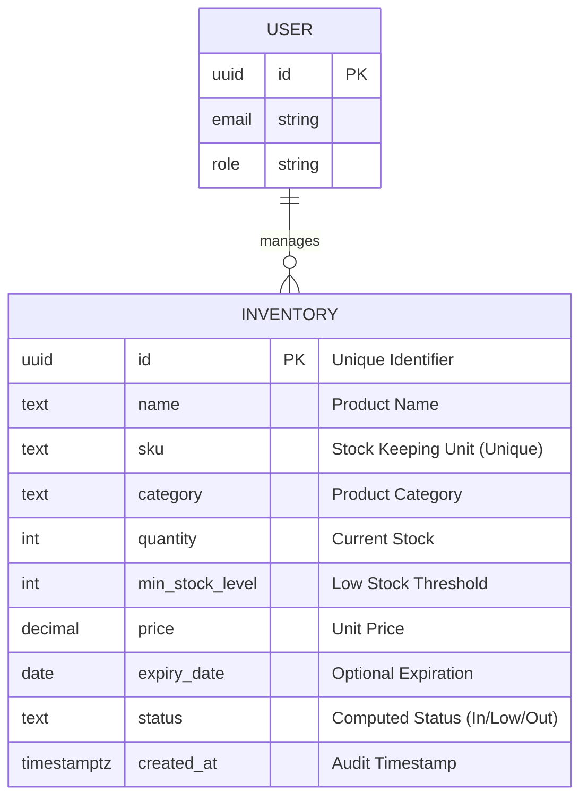
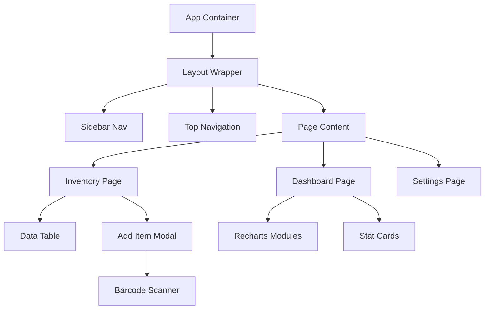

# SIMS: System Design Document

## 1. Project Overview
**Project Name**: Smart Inventory Management System (SIMS)
**Description**: SIMS is a modern, responsive web application designed to help small businesses track inventory, monitor stock levels, and manage product data efficiently. It automates manual tracking through features like barcode scanning and provides real-time insights into business performance.

## 2. System Architecture

### 2.1 High-Level Architecture
The system follows a **Client-Server** architecture (Serverless). The frontend is a Single Page Application (SPA) that communicates directly with a cloud-hosted generic backend (Supabase) via RESTful APIs and WebSocket subscriptions.

```mermaid
graph TD
    User[Clients (Mobile/Desktop)] -->|HTTPS| CDN[Vite/Edge Network]
    CDN -->|Load App| Frontend[React SPA]
    
    subgraph Frontend Logic
        UI[UI Components]
        State[Context/State Management]
        Scanner[Barcode Scanner Module]
    end
    
    Frontend -->|REST / Realtime| Backend[Supabase Platform]
    
    subgraph Backend Services
        Auth[Authentication Service]
        DB[(PostgreSQL Database)]
        Storage[File Storage]
        Edge[Edge Functions]
    end
    
    Backend --> DB
```

### 2.2 Technology Stack
| Component | Technology | Rationale |
| :--- | :--- | :--- |
| **Frontend** | React 19, TypeScript | Robust component-based architecture, type safety. |
| **Build Tool** | Vite | Extremely fast HMR and optimized production builds. |
| **Styling** | Tailwind CSS v3 | Utility-first, responsive design system. |
| **Backend** | Supabase | Managed PostgreSQL, auto-generated APIs, real-time capabilities. |
| **Database** | PostgreSQL | Relational data integrity, powerful querying. |
| **Scanning** | html5-qrcode | Cross-platform camera access for reading barcodes. |
| **Hosting** | Vercel (Recommended) | Seamless integration with Vite and Git. |

## 3. Database Design

### 3.1 Entity Relationship Diagram (ERD)
The core of the system is the `inventory` table, designed to store product metadata and stock levels.



## 4. System Interactions (UML)

### 4.1 User Flow: Adding Inventory with Barcode
This sequence illustrates the interaction between the User, the UI Components, the Scanner, and the Database.

```mermaid
sequenceDiagram
    participant U as User
    participant UI as Add Item Modal
    participant Cam as Barcode Scanner
    participant DB as Supabase DB

    U->>UI: Click "Add Item"
    UI->>U: Display Form
    U->>UI: Click "Scan Barcode"
    UI->>Cam: Activate Camera
    Cam-->>U: Show Camera Overlay
    U->>Cam: Points Camera at Product
    Cam->>UI: Returns Decoded SKU (e.g., "12345")
    UI-->>U: Auto-fills SKU Field
    U->>UI: Fills remaining fields (Name, Price, Qty)
    U->>UI: Click "Save"
    UI->>DB: INSERT INTO inventory (...)
    DB-->>UI: Return Success + New Record
    UI-->>U: Close Modal & Update List
```



### 4.2 Component Diagram
Proposed structure of the frontend application.



## 5. Implementation Plan & Milestones

### Phase 1: Planning & Design (Days 1-3)
- [x] Requirement Gathering & SRS.
- [x] Tech Stack Selection.
- [x] UI Wireframing (Figma/Sketch).
- [x] Database Schema Design.

### Phase 2: Fundamental Setup (Days 4-5)
- [x] Git Repo Setup.
- [x] Vite + React Framework Initialization.
- [x] Tailwind CSS Configuration.

### Phase 3: Core Development (Days 6-10)
- [x] **Inventory Module**: CRUD operations for products.
- [x] **Database Integration**: Connecting to real PostgreSQL DB.
- [x] **Barcode Scanner**: Integrating camera API.
- [x] **Dashboard**: Visualizing stock data.

### Phase 4: Polish & Advanced Features (Days 11-14)
- [x] **Responsive Design**: Mobile-first layout adaptation.
- [x] **Localization**: Currency/Region settings.
- [x] **PWA Support**: Offline capabilities.

### Phase 5: Testing & Deployment (Days 15+)
- [x] System Testing (Functional, Responsive).
- [ ] User Acceptance Testing (UAT).
- [ ] Production Deployment (Vercel/Netlify).

## 6. Roles & Responsibilities Matrix

| Category | Role | Responsibilities & Access |
| :--- | :--- | :--- |
| **Stakeholder** | **Business Owner** | **Project Sponsor**: Defines business goals, approves requirements, and validates solution value. |
| **Stakeholder** | **Project Supervisor** | **QA / Mentor**: Reviews technical architecture, ensures best practices, and evaluates milestones. |
| **Stakeholder** | **Development Team** | **Technical Lead**: Responsible for the full SDLC: System architecture, coding, testing, and deployment. |
| **System User** | **Store Manager** | **Administrator**: Full control. Accesses Settings, manages users, views financial reports, and configures plans. |
| **System User** | **Inventory Clerk** | **Standard User**: Operational access. Primary user of the Barcode Scanner for adding items and stock updates. |
| **System User** | **Auditor/Guest** | **Viewer**: Read-only access. Can view dashboard analytics and generate reports but cannot modify data. |
